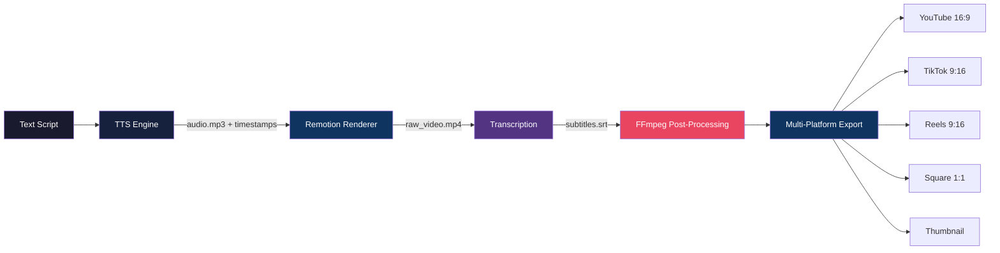
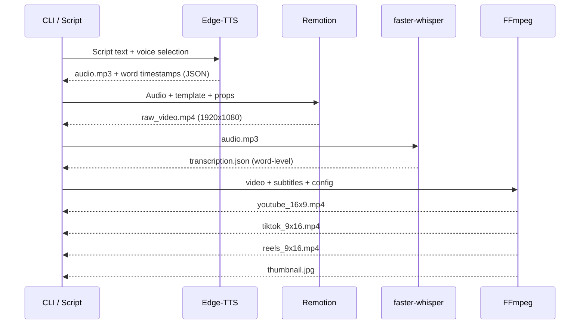

# AI Video Factory

**Automated video production pipeline — from text script to multi-platform video in one command.**

Transform a text script into a fully rendered video with AI voiceover, word-by-word animated captions, and multi-platform exports for YouTube, TikTok, Instagram Reels, and YouTube Shorts.

```bash
npm run generate -- \
  --script "5 claves para implementar IA en tu empresa" \
  --voice "es-MX-JorgeNeural" \
  --template "explainer" \
  --platforms youtube,tiktok,reels
```

---

## Pipeline Architecture



### Detailed Pipeline Flow



---

## Features

- **AI Voiceover** — 45+ Spanish neural voices via Edge-TTS (free, unlimited)
- **React Video Templates** — Remotion-powered compositions with animated text, captions, transitions
- **Word-by-Word Captions** — TikTok-style animated captions synced to audio
- **Multi-Platform Export** — One render, four formats (16:9, 9:16, 1:1) + thumbnails
- **Audio Normalization** — EBU R128 loudness normalization per platform
- **Template System** — Reusable JSON-configured video templates
- **CLI-First** — Everything runnable from terminal, no GUI required
- **Local-Only** — Runs entirely on your machine, no cloud services needed

---

## Tech Stack

| Component | Technology | Purpose |
|-----------|-----------|---------|
| Video Rendering | [Remotion v4](https://remotion.dev) | React → frames → MP4 |
| Text-to-Speech | [Edge-TTS](https://github.com/rany2/edge-tts) | Free neural voices (45+ Spanish) |
| Transcription | [faster-whisper](https://github.com/SYSTRAN/faster-whisper) | Local audio → text with word timestamps |
| Post-Processing | [FFmpeg](https://ffmpeg.org) | Resize, subtitles, normalize, watermark |
| Pipeline | TypeScript + [tsx](https://github.com/privatenumber/tsx) + [execa](https://github.com/sindresorhus/execa) | Orchestration |
| CLI | [Commander.js](https://github.com/tj/commander.js) | Command-line interface |
| Testing | [Vitest](https://vitest.dev) + [pytest](https://pytest.org) | JS + Python tests |

---

## Quick Start

### Prerequisites

- **macOS** with Apple Silicon (M1/M2/M3/M4)
- **Node.js 22+** (LTS)
- **Python 3.11+**
- **FFmpeg** (`brew install ffmpeg`)
- **uv** (Python package manager: `curl -LsSf https://astral.sh/uv/install.sh | sh`)

### Installation

```bash
# Clone the repository
git clone https://github.com/your-username/ai-video-factory.git
cd ai-video-factory

# Install all dependencies
make install

# Or manually:
npm install
uv sync
```

### Verify Setup

```bash
make check
# Output:
# Node.js: v22.x.x
# Python: Python 3.11.x
# uv: uv 0.x.x
# FFmpeg: ffmpeg version 6.x
```

---

## Usage

### Generate a Video

```bash
# Full pipeline: script → TTS → render → transcribe → export
npm run generate -- \
  --script "Las 5 tendencias de IA que cambiarán tu negocio en 2026" \
  --voice "es-MX-JorgeNeural" \
  --template "explainer" \
  --platforms youtube,tiktok

# From a script file
npm run generate -- \
  --script-file ./scripts/my-video.json \
  --template "listicle"
```

### Preview in Remotion Studio

```bash
# Launch visual editor to preview compositions
npm run dev
```

### Render a Single Composition

```bash
npm run render -- \
  --comp ExplainerVideo \
  --props ./data.json \
  --out ./output/video.mp4
```

### List Available Voices

```bash
npm run voices
# Shows all 45+ Spanish neural voices with region and gender
```

### List Templates

```bash
npm run templates
# Shows available video templates with descriptions
```

---

## Video Templates

### Explainer
Clean text-on-screen explainer with gradient background and animated captions. Best for educational content.

### Talking Head
Speaker image/video with word-by-word caption overlay. Best for personal brand content.

### Listicle
Numbered items with animated transitions between points. Best for "Top 5" / "3 tips" style content.

### Quote Card
Animated quote with author attribution. Best for social media clips.

Each template accepts a JSON configuration:

```json
{
  "template": "explainer",
  "script": "Your script text here",
  "voice": "es-MX-JorgeNeural",
  "style": {
    "accentColor": "#00d4ff",
    "backgroundColor": "#0a0e27",
    "fontFamily": "Inter"
  },
  "captions": {
    "enabled": true,
    "style": "highlighted",
    "position": "bottom"
  },
  "platforms": ["youtube", "tiktok", "reels", "square"]
}
```

---

## Available Spanish Voices

Edge-TTS provides **45 neural voices** across 20+ Spanish-speaking regions:

| Voice | Region | Gender | Best For |
|-------|--------|--------|----------|
| `es-MX-JorgeNeural` | Mexico | Male | Professional, business content |
| `es-MX-DaliaNeural` | Mexico | Female | Warm, engaging narration |
| `es-ES-AlvaroNeural` | Spain | Male | European Spanish audience |
| `es-ES-ElviraNeural` | Spain | Female | Formal, educational |
| `es-AR-TomasNeural` | Argentina | Male | Southern Cone audience |
| `es-AR-ElenaNeural` | Argentina | Female | Conversational tone |
| `es-CO-GonzaloNeural` | Colombia | Male | Clear, neutral accent |
| `es-CO-SalomeNeural` | Colombia | Female | Friendly, approachable |
| `es-US-AlonsoNeural` | US Spanish | Male | US Hispanic audience |
| `es-US-PalomaNeural` | US Spanish | Female | Bilingual content |

<details>
<summary>View all 45 voices</summary>

| Voice | Region | Gender |
|-------|--------|--------|
| `es-BO-MarceloNeural` | Bolivia | Male |
| `es-BO-SofiaNeural` | Bolivia | Female |
| `es-CL-CatalinaNeural` | Chile | Female |
| `es-CL-LorenzoNeural` | Chile | Male |
| `es-CR-JuanNeural` | Costa Rica | Male |
| `es-CR-MariaNeural` | Costa Rica | Female |
| `es-CU-BelkysNeural` | Cuba | Female |
| `es-CU-ManuelNeural` | Cuba | Male |
| `es-DO-EmilioNeural` | Dominican Republic | Male |
| `es-DO-RamonaNeural` | Dominican Republic | Female |
| `es-EC-AndreaNeural` | Ecuador | Female |
| `es-EC-LuisNeural` | Ecuador | Male |
| `es-ES-XimenaNeural` | Spain | Female |
| `es-GQ-JavierNeural` | Equatorial Guinea | Male |
| `es-GQ-TeresaNeural` | Equatorial Guinea | Female |
| `es-GT-AndresNeural` | Guatemala | Male |
| `es-GT-MartaNeural` | Guatemala | Female |
| `es-HN-CarlosNeural` | Honduras | Male |
| `es-HN-KarlaNeural` | Honduras | Female |
| `es-NI-FedericoNeural` | Nicaragua | Male |
| `es-NI-YolandaNeural` | Nicaragua | Female |
| `es-PA-MargaritaNeural` | Panama | Female |
| `es-PA-RobertoNeural` | Panama | Male |
| `es-PE-AlexNeural` | Peru | Male |
| `es-PE-CamilaNeural` | Peru | Female |
| `es-PR-KarinaNeural` | Puerto Rico | Female |
| `es-PR-VictorNeural` | Puerto Rico | Male |
| `es-PY-MarioNeural` | Paraguay | Male |
| `es-PY-TaniaNeural` | Paraguay | Female |
| `es-SV-LorenaNeural` | El Salvador | Female |
| `es-SV-RodrigoNeural` | El Salvador | Male |
| `es-UY-MateoNeural` | Uruguay | Male |
| `es-UY-ValentinaNeural` | Uruguay | Female |
| `es-VE-PaolaNeural` | Venezuela | Female |
| `es-VE-SebastianNeural` | Venezuela | Male |

</details>

---

## Project Structure

```
ai-video-factory/
├── src/
│   ├── compositions/          # Remotion video templates
│   │   ├── ExplainerVideo.tsx
│   │   ├── TalkingHead.tsx
│   │   ├── Listicle.tsx
│   │   └── QuoteCard.tsx
│   ├── components/            # Shared React components
│   ├── pipeline/              # TypeScript orchestration
│   │   ├── generate.ts        # CLI entry point
│   │   └── pipeline.ts        # Pipeline steps
│   ├── tts/                   # Edge-TTS wrapper
│   ├── transcribe/            # faster-whisper wrapper
│   └── ffmpeg/                # FFmpeg command builders
├── templates/                 # Video template configs (JSON)
├── tests/                     # Vitest + pytest suites
├── output/                    # Generated videos (gitignored)
├── Makefile                   # Development commands
├── package.json
├── pyproject.toml
└── docker-compose.dev.yml     # Local dev only (optional Redis)
```

---

## FFmpeg Post-Processing

The pipeline automatically handles:

- **Subtitle burning** — ASS format with word-by-word highlighting (karaoke-style)
- **Multi-platform resize** — Smart cropping for vertical, padding for landscape
- **Audio normalization** — EBU R128 two-pass loudnorm (YouTube: -14 LUFS)
- **Thumbnail extraction** — Scene-change detection for best frame
- **Watermark overlay** — PNG with transparency, positioned in any corner
- **Video concatenation** — Intro + main + outro with crossfade transitions

### Platform Output Specs

| Platform | Resolution | Aspect Ratio | Audio Target |
|----------|-----------|--------------|-------------|
| YouTube | 1920x1080 | 16:9 | -14 LUFS |
| TikTok | 1080x1920 | 9:16 | -14 LUFS |
| Instagram Reels | 1080x1920 | 9:16 | -14 LUFS |
| YouTube Shorts | 1080x1920 | 9:16 | -14 LUFS |
| Instagram Feed | 1080x1080 | 1:1 | -14 LUFS |

---

## Development

### Run Tests

```bash
make test          # All tests
make test-js       # Vitest only (Remotion compositions)
make test-py       # Pytest only (TTS, transcription)
```

### Local Docker Services (Optional)

```bash
# Start Redis for future BullMQ integration
docker compose -f docker-compose.dev.yml up -d
```

### Lint

```bash
make lint
```

---

## How It Works

### 1. Text-to-Speech (Edge-TTS)

Your script text is converted to natural-sounding speech using Microsoft's Edge neural voices. Edge-TTS also generates **word-level timestamps** — the exact start/end time of every word — which power the animated captions.

### 2. Video Rendering (Remotion)

Remotion renders React components frame-by-frame using Chrome Headless Shell, then encodes via FFmpeg. Each template is a React component that receives your script, audio, and style configuration as props. Animations use Remotion's `interpolate()` and `spring()` functions for smooth motion.

### 3. Transcription (faster-whisper)

The generated audio is transcribed locally using the `small` model (~88% accuracy for Spanish, ~2GB RAM). Word-level timestamps enable precise caption synchronization.

### 4. Post-Processing (FFmpeg)

The raw video is processed through FFmpeg for subtitle burning (ASS format for styled captions), multi-platform resizing, audio normalization, and thumbnail extraction. Apple Silicon hardware acceleration via VideoToolbox is used when available.

---

## Licensing

- **Remotion** — Free for individuals and companies with < $1M revenue. See [Remotion License](https://remotion.dev/license).
- **Edge-TTS** — Free (uses Microsoft Edge's speech synthesis API). MIT license.
- **faster-whisper** — MIT license. Uses OpenAI Whisper models (MIT).
- **FFmpeg** — LGPL/GPL depending on build configuration.

---

## Roadmap

- [ ] Remotion compositions with Zod prop validation
- [ ] CLI with Commander.js
- [ ] Pipeline orchestration (tsx + execa)
- [ ] Edge-TTS integration with word timestamps
- [ ] faster-whisper transcription wrapper
- [ ] FFmpeg command builders
- [ ] Multi-platform export pipeline
- [ ] Template: Explainer
- [ ] Template: Talking Head
- [ ] Template: Listicle
- [ ] Template: Quote Card
- [ ] Vitest snapshot tests for compositions
- [ ] Pytest tests for Python wrappers
- [ ] Batch video generation from CSV/JSON
- [ ] N8N webhook trigger integration
- [ ] Background music mixing

---

## Contributing

This is a personal automation tool. If you find it useful, feel free to fork and adapt for your own video pipeline.

---

Built with Remotion, Edge-TTS, faster-whisper, and FFmpeg on Apple Silicon.
